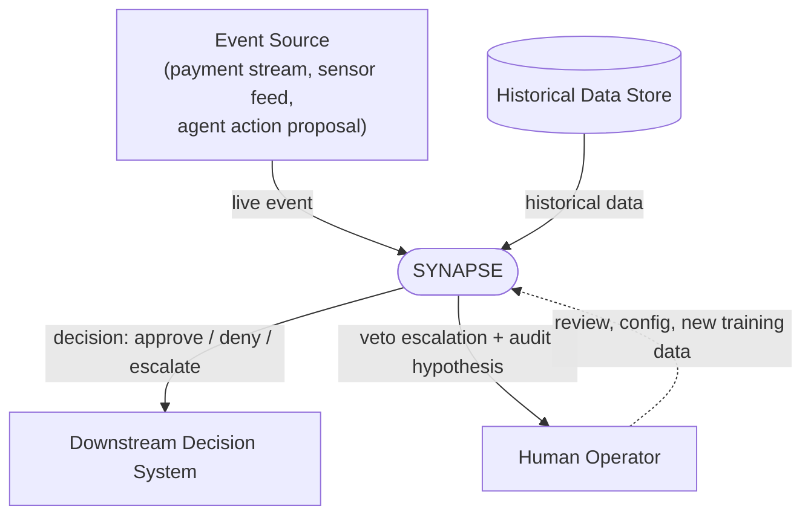
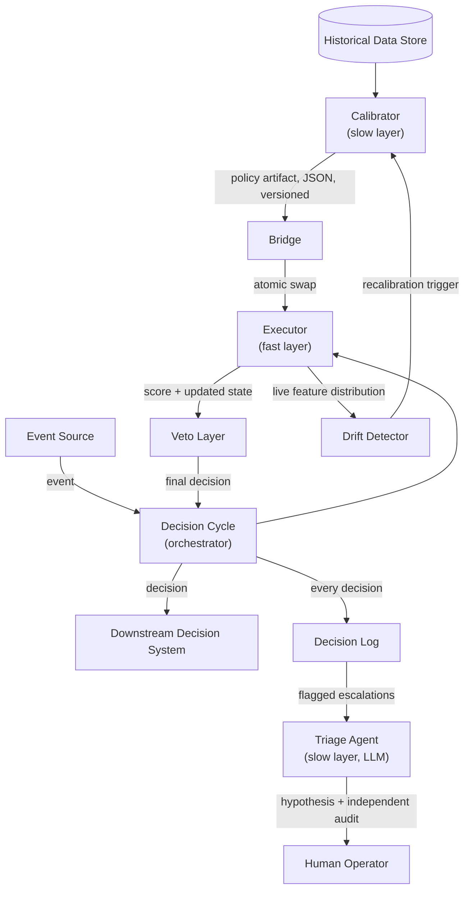

# SYNAPSE — Architecture

This document describes SYNAPSE at the level of what each piece is
responsible for and how they talk to each other — not how any of them is
implemented. For implementation detail, read the source directly (`src/`)
and the [ADRs](adr/README.md), which record *why* each of these boundaries
exists.

An interactive, explorable version of the diagrams below — with guided
views, source references, and a light/dark theme — is available at
[`architecture_diagram.html`](architecture_diagram.html).

## Level 1 — System Context

SYNAPSE sits between a stream of events that need a decision and the
systems/people that act on that decision. It has four kinds of neighbors:

- **Event Source** — whatever produces the events SYNAPSE decides on (a
  payment stream, a sensor feed, an agent's proposed action). Sends one
  event, expects one decision.
- **Historical Data Store** — the offline source the Calibrator learns
  from. Never touched by the hot path.
- **Downstream Decision System** — whatever consumes SYNAPSE's decision
  (approve/deny/escalate) and acts on it — it does not see SYNAPSE's
  internals, only the decision.
- **Human Operator** — reviews Veto escalations, via the Triage Agent's
  output and the Decision Log. Can grant the Calibrator new historical
  data or adjust configuration, but never intervenes on an individual
  hot-path decision in real time — the system does not wait on a human.

## Level 2 — Containers

Inside SYNAPSE, four containers form the two-speed core (Calibrator,
Bridge, Executor, Veto). Three more support it (Drift Detector, Decision
Log, Triage Agent), and one orchestrates the hot path (the Decision
Cycle).

---

### Calibrator

**Purpose.** Turns historical data into a policy — the only place in the
system that "learns." Runs offline, with no latency constraint, so it can
be as expensive or as iterative as the problem requires.

**Responsibilities**
- Load and validate historical data.
- Fit whatever model or statistical procedure the domain calls for.
- Choose a decision threshold from validation data.
- Emit a Policy Artifact: a versioned, self-contained description of the
  learned policy.

**Non-responsibilities**
- Never runs on the hot path and never sees a live event.
- Never decides — it only produces the artifact the Executor will later
  apply.
- Never writes the artifact directly to the location the Executor reads
  from — that's the Bridge's job.

**Interfaces**
- In: historical dataset (`cargar_dataset`), a train/validation split
  (`split_temporal`).
- Out: a policy dict (`calibrar`) — model coefficients, chosen threshold,
  validation metrics — written to disk via `guardar_artefacto`.

---

### Policy Artifact

Not a running component but the contract between the two speeds, so it's
worth naming on its own: a versioned JSON document (weights, thresholds,
validation metrics, a version number). It is the *only* channel through
which the slow layer can influence the fast layer. No other state,
code, or side channel crosses that boundary.

---

### Bridge

**Purpose.** Publishes a new Policy Artifact without ever letting the
Executor observe a partially written one.

**Responsibilities**
- Write the new artifact to a temporary path, then atomically replace the
  file the Executor reads.
- Read back the currently published artifact on request.

**Non-responsibilities**
- Never validates the artifact's content — that's the Calibrator's job on
  the way in, and the Executor's job (fail loud) on the way out if it's
  malformed.
- Never decides when to publish — it's invoked by the Calibrator/drift
  recalibration path, not on a timer of its own.

**Interfaces**
- In: an artifact dict + destination path (`publicar`).
- Out: the currently published artifact (`leer_vigente`).

---

### Executor

**Purpose.** Applies the current Policy Artifact to one event and returns
a decision, in microseconds. This is the hot path — the entire reason the
two speeds are split.

**Responsibilities**
- Maintain whatever compact, O(1)-updatable state a decision needs
  (e.g., recursive per-entity aggregates).
- Score one event against the current artifact using pure arithmetic.
- Reload the artifact live when the Bridge publishes a new version,
  without losing accumulated state, and without ever running on a
  half-written one.

**Non-responsibilities**
- Never trains, retrains, or fits anything.
- Never performs model inference beyond evaluating an already-calibrated
  artifact.
- Never makes a network call.
- Never applies the hard invariants itself — that's the Veto Layer,
  deliberately kept model-independent and separate.

**Interfaces**
- In: one event (`decidir(transaccion: dict)`).
- Out: a score plus the Executor's internal result for that event, passed
  to the Veto Layer — not yet the final decision.

---

### Veto Layer

**Purpose.** The hard backstop. Enforces invariants that must hold
regardless of what the model scored, so the system stays correct even if
the Calibrator or the Executor is wrong.

**Responsibilities**
- Evaluate a fixed set of model-independent rules against the event and
  the Executor's result (e.g., absolute amount limits, invalid/impossible
  input, out-of-range scores).
- Override the Executor's decision whenever a rule fires — always, no
  confidence threshold negotiates this.
- Produce the final decision structure returned to the Decision Cycle.

**Non-responsibilities**
- Never trusts model confidence as a substitute for its own checks.
- Never learns or adapts — its rules change only through a deliberate,
  reviewed change, not through data.

**Interfaces**
- In: the Executor's result plus the original event
  (`evaluar(resultado_ejecutor, transaccion, ...)`).
- Out: a final decision (`DecisionFinal`).

---

### Decision Cycle (Orchestrator)

**Purpose.** The single real entry point into SYNAPSE. Guarantees that
every event goes through the Bridge, the Executor, and the Veto Layer in
order, and that no failure anywhere in that chain escapes as an
uncaught exception.

**Responsibilities**
- Route one event through Executor → Veto Layer.
- Convert any failure (missing/corrupt artifact, an Executor error) into
  a real decision — escalate to manual review — instead of propagating an
  exception to the caller.
- Expose the live reload path (`recargar_artefacto`) that lets a new
  artifact take effect without restarting the process or discarding
  accumulated Executor state; a failed reload changes nothing.

**Non-responsibilities**
- Never bypassed — it is the only supported way to get a decision out of
  SYNAPSE.
- Never retries silently — a failure becomes an explicit escalation, not
  a quiet fallback.

**Interfaces**
- In: one event (`decidir(transaccion: dict)`).
- Out: `DecisionFinal`, always — even on internal failure.

---

### Drift Detector

**Purpose.** Watches whether the live event distribution still matches
what the Calibrator trained on, and decides when it doesn't.

**Responsibilities**
- Compute PSI (Population Stability Index) and Kolmogorov-Smirnov
  statistics between a reference distribution and the live one, per
  feature and on the output score.
- Weight drift by how much each feature actually matters to the current
  artifact (its coefficient), not just by raw statistical distance.
- Recommend — and, in the automated trigger path, initiate — recalibration
  when drift crosses a significance threshold.

**Non-responsibilities**
- Never touches the hot path directly — it observes what the Executor
  has already decided, asynchronously.
- Never decides an individual event; its output is a system-level signal,
  not a per-event score.

**Interfaces**
- In: reference and live feature distributions (`evaluar_deriva`), scores
  (`evaluar_deriva_score`), current artifact coefficients
  (`ponderar_deriva_por_coeficiente`).
- Out: a drift report and, when warranted, a recalibration trigger
  (`evaluar_y_recalibrar_si_hace_falta`) that feeds back into the
  Calibrator.

---

### Decision Log

**Purpose.** The system of record — every decision, auditable after the
fact.

**Responsibilities**
- Persist every decision the Decision Cycle produces, with enough context
  to reconstruct why it happened.
- Classify escalations by type so operational review can be targeted
  instead of reading the full log.

**Non-responsibilities**
- Never filters or drops entries — completeness is the point.
- Never makes a decision or influences one; strictly a write-then-read
  audit trail.

**Interfaces**
- In: one decision (`registrar_decision`).
- Out: the full log (`leer_bitacora`), or just the operational
  escalations (`filtrar_escalamientos_operativos`) for the Triage Agent.

---

### Triage Agent

**Purpose.** Applies an LLM, in the slow layer only, to propose a
hypothesis for *why* a Veto escalation happened — never to decide, never
on the hot path.

**Responsibilities**
- Read flagged escalations from the Decision Log.
- Ask an LLM for a grounded hypothesis (schema-validated response,
  checked against the actual entry, then independently audited by a
  second pass) instead of trusting a raw model response.
- Rate-limit its own LLM calls and fail explicitly (open circuit) rather
  than degrade silently when the budget is exhausted.

**Non-responsibilities**
- Never overrides, confirms, or feeds back into a Veto decision — its
  output is a hypothesis for a human, not a verdict.
- Never runs without an explicit `ANTHROPIC_API_KEY` — no silent fallback
  to a fabricated result when the credential is missing.

**Interfaces**
- In: one escalation entry plus its context (`triar(entrada, contexto)`).
- Out: `ResultadoTriage` — the LLM's hypothesis plus the independent audit
  result — for a human operator to read.

---

## Design Principles

- **Fail loud, never silent.** A missing artifact, a corrupt state, an
  LLM budget exhausted, a malformed response — every failure becomes an
  explicit escalation or an exception, never a quiet fallback that looks
  like success.
- **Separation of learning from deciding.** The Calibrator and the
  Executor never share a time budget, a process, or an implicit
  dependency beyond the Policy Artifact.
- **Hard invariants over model confidence.** The Veto Layer's rules hold
  regardless of what the model believes — confidence is not a substitute
  for a guarantee.
- **Versioned policy contracts.** Every decision can be traced to the
  exact artifact version that produced it; nothing crosses the
  slow/fast boundary except that versioned artifact.
- **Full auditability.** Every decision is logged, every escalation is
  classified, and every Triage hypothesis is independently audited before
  a human sees it.
